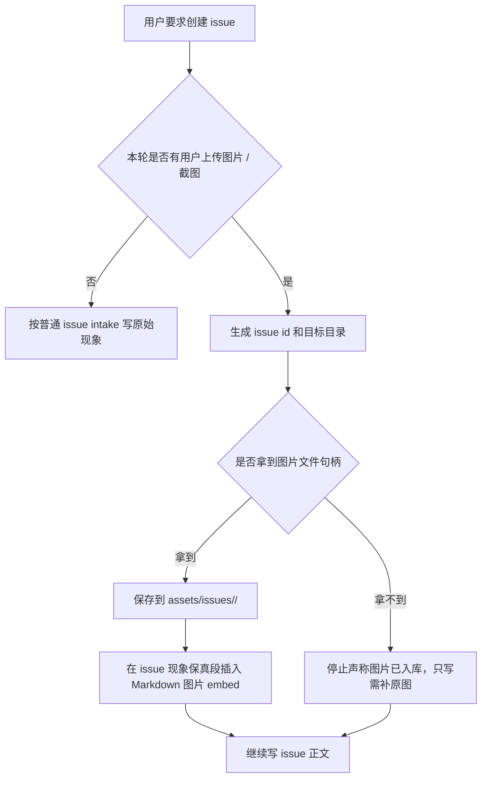

# Issue 创建阶段截图保存规则不生效分析

相关：[[concepts/agent-governance]]、[[concepts/harness-engineering]]、[[instruction-adherence]]、[[response-mode-routing]]、[[skills/issue-analysis/SKILL]]、[[projects/development/issues/README]]

## 来源与调研依据

- **用户纠偏**：用户上传截图和问题描述后，agent 创建 issue 时没有把原始截图保存下来，也没有在 issue 文档里用 Markdown 图片语法引用；用户明确指出这一步不需要复现，要求的只是保存截图并在 issue 文档中引用。
- **旧规则现状**：以 `DocCustomeranalysis` 为例，旧规则已经存在，而且写得很明确：
  - `AGENTS.md` 已写明遇到用户图片时，先保存到目标页面对应的 `assets/` 子目录，再用标准 Markdown 图片语法嵌入预览；issue 用 `assets/issues/<issue-id>/`。
  - `projects/development/issues/README.md` 已写明创建或更新 ISSUE 前必须先尝试把用户原始图落盘，并用 `` 引用实际存在的图片文件。
  - `skills/issue-analysis/SKILL.md` 已写明用户上传截图或要求保存截图时，执行顺序必须是先保存图片，再在目标正文引用该文件。
  - `governance/instruction-adherence.md` 已把用户截图 / 标注图 / 图片附件绑定为触发信号。
- **官方技术依据**：
  - OpenAI Images and vision 文档说明图片可以通过 URL、Base64、字节数组或 `file_id` 进入模型；这说明“模型能看图”和“本地仓库已保存图片文件”是两个不同动作。来源：[Images and vision](https://developers.openai.com/api/docs/guides/images-vision)。
  - OpenAI File inputs 文档说明文件输入通过 Files API 创建文件并用 `file_id` 传入模型；这说明文件引用、模型输入和知识库本地归档之间需要显式桥接。来源：[File inputs](https://developers.openai.com/api/docs/guides/file-inputs)。
  - Codex 官方手册说明 skill 是可复用工作流，依赖触发匹配；`AGENTS.md` 是持久项目指导，但仍只是启动上下文里的自然语言，不天然等于执行门禁。来源：[Codex skills](https://developers.openai.com/codex/skills)、[AGENTS.md](https://developers.openai.com/codex/guides/agents-md)。

## 一句话总结

这次失败不是“没有截图保存规则”，也不是“需要浏览器复现”。一级根因是 **场景分流 / 场景识别失败**：agent 没有把本轮识别成“带用户上传截图的 issue 创建”，而是分流成普通 issue 分析 / 文本落档；于是已有 skill / AGENTS / README 里的截图保存规则没有进入第一执行槽位。

更精确地说：

```text
用户输入 = 截图附件 + 问题描述 + 创建 issue

应该分流到：
带图 issue 创建 -> 先保存截图 -> Markdown embed -> 写 issue 正文 -> 不复现

实际分流到：
普通 issue 分析 / 快速落档 -> 写 issue 正文 -> 用文字说明截图状态 -> 漏保存
```

## 正确执行目标

用户上传截图并要求创建 issue 时，issue 创建阶段只需要做：

1. 生成或确认 issue id。
2. 把用户原始截图保存到 `assets/issues/<issue-id>/`。
3. 在 issue 文档的 `## 现象保真` 或等价位置用标准 Markdown 图片语法引用：

```markdown

```

4. 再写必要的用户原始描述、期望行为、影响范围和关闭标准。

这一步 **不需要浏览器复现**。浏览器复现只在截图、入口或期望行为不足以形成案件档案时才需要。

## 为什么旧 skill 已有规则但不生效

### 1. 一级根因：场景识别没有把“带图 issue 创建”单独分流

这轮用户输入不是普通“分析一个问题”，而是一个组合场景：

```text
用户上传图片附件 + 用户描述问题 + 用户要求生成 / 归档 issue
```

这个组合场景的第一动作不是根因分析、不是复现、也不是补上下文，而是截图持久化。旧 skill 里虽然写了图片入口规则，但分流层没有先问：

- 本轮是否是 issue 创建？
- 本轮是否带用户上传图片？
- 如果二者同时成立，是否已执行截图保存和 Markdown embed？

由于没有这个场景识别门，后续步骤虽然读到了 issue skill，也可能只执行了 issue 分析里的“问题框 / 证据链 / 最小落档”，没有执行图片附件证据入口。

### 2. 规则存在，但不在 issue 创建的第一执行槽位

旧规则分布在 `AGENTS.md`、issue README、`issue-analysis` skill 和 `instruction-adherence` 中。它们说明了“应该怎么做”，但 issue 创建动作本身没有一个固定的第一槽位：

```text
create_issue()
  1. persist_uploaded_screenshot()
  2. embed_screenshot_markdown()
  3. write_issue_body()
```

于是 agent 在执行时会先写 issue 正文，把截图当成“证据描述”处理，而不是先做“文件落盘动作”。当正文已经写完，再补图就变成额外工作，容易被省掉或写成“图片未保存”。

### 3. Issue Intake 快路径优化了复现成本，却没有绑定截图落盘

旧快路径的出发点是对的：用户已经提供截图、入口和期望行为时，不要默认打开浏览器复现。

但这条规则只解决了“是否复现”，没有把“截图保存”写成跳过复现前的必做动作。结果路径变成：

```text
用户有截图 -> 不复现 -> 直接写 issue 文本
```

正确路径应该是：

```text
用户有截图 -> 保存截图 -> Markdown embed -> 不复现 -> 写 issue 文本
```

也就是说，快路径少了一道 Evidence Persistence Gate。这个 gate 不是复现，不增加浏览器成本，只是把用户原图变成 issue 文件的一部分。

### 4. “模型能看见图片”被误当成“截图已进入证据链”

多模态对话里，agent 可能能理解用户上传的截图内容，但这不等于它有可写入仓库的图片文件句柄。技术上至少有三种状态：

| 状态 | 含义 | 应该怎么写 |
| --- | --- | --- |
| `visible_only` | 模型能看图，但没有文件路径 / 字节 / URL / file id | 不能说已保存；应阻塞截图入库或要求补原图 |
| `handle_available` | 有本地路径、字节、URL 或 file id | 必须保存到 `assets/issues/<issue-id>/` |
| `saved_and_embedded` | 文件已在仓库里，issue 已 Markdown 引用 | 图片证据完成 |

旧规则虽然说“能保存就保存，不能保存就说明”，但实际 issue 创建时没有强制输出这三个状态，导致 agent 用“截图已提供”替代了 `saved_and_embedded`。

### 5. 检查器更多检查文案异常，不能替 agent 执行文件保存

旧规则里已经有 sensor / 检查器思路：如果图片没预览、却写“证据已补”，要红灯。但检查器通常只能在文件已经写完后发现文字和链接问题。

它不能自动完成：

- 从对话附件中取出原始图片。
- 写入 `assets/issues/<issue-id>/`。
- 生成正确相对路径。
- 在 issue 正文插入 Markdown 图片引用。

所以如果 issue 创建阶段没有把保存截图作为第一动作，事后检查只能发现“不完整”，不能保证一开始就做对。

### 6. 规则触发词和真实用户表达之间仍有缝隙

旧规则里触发词包括“截图保存 / 截图落库 / 图片归档 / 保存证据图”。但真实用户经常说的是：

- “我上传了一张图和问题描述。”
- “按规则你应该保存截图到 issue。”
- “生成 issue。”

这些表达对人很清楚，但对 skill 触发来说可能被归到“issue 创建”而不是“截图保存”。如果 issue 创建入口没有主动扫描“本轮是否带图片附件”，就会漏触发截图保存分支。

### 根因链

```text
场景识别不足
  -> 没有分流到“带图 issue 创建”
  -> 没有触发截图持久化第一步
  -> Issue Intake 快路径直接写正文
  -> 旧 skill 中的图片保存规则虽然存在但未执行
  -> 最终 issue 只有文字说明，没有原图 Markdown embed
```

## 最完善且高效的方案

### 方案原则

- 不新增浏览器复现。
- 不要求用户重复描述图片内容。
- 不把截图摘要当证据。
- 不在 issue 正文展示路径、hash、尺寸或内部状态码。
- 只做一个很小但不可跳过的动作：**先保存图，再 Markdown embed。**

### 推荐执行顺序



### 最小执行合同

把 issue 创建的第一段执行合同写成：

```text
如果本轮用户消息含图片附件：
1. 先保存用户原始图片到 assets/issues/<issue-id>/。
2. issue 正文必须出现标准 Markdown 图片引用，且目标文件实际存在。
3. 完成这两步后，才写其他 issue 正文。
4. 若工具拿不到图片句柄，不能写“截图已保存 / 证据已沉淀”；只能写“已收到用户图片，但图片文件尚未保存，需补原图”。
5. 不做浏览器复现，除非用户提供的信息不足以形成 issue。
```

### 推荐最小模板片段

不需要新开复杂的“证据资产”章节，直接放在 `## 现象保真` 里即可：

```markdown
## 现象保真

- 用户原始描述：


```

图片保存失败时，只写自然语言边界，不写内部状态码：

```markdown
## 现象保真

- 用户原始描述：
- 已收到用户图片，但当前工具未取得可保存的图片文件，图片文件尚未保存，需补原图。
```

## 真正要解决的失效点

| 失效点 | 修法 |
| --- | --- |
| 旧规则在多个页面里，但 issue 创建没有第一步动作 | 给 issue 创建流程加固定第一步：保存并 embed 用户截图 |
| 快路径只说不复现，没有说先保存图 | 把快路径改成“先保存图，再跳过复现” |
| 场景识别把带图 issue 创建分成普通 issue 分析 | issue 创建入口先识别 `用户上传图 + 创建 issue` 组合场景，并强制进入截图持久化分支 |
| skill 可能只触发了 issue 分析部分，没有触发图片附件入口 | issue 创建入口自己扫描本轮是否有图片附件，不依赖用户说 `$issue-analysis` 或“截图落库” |
| 检查器只能事后发现文字问题 | 检查器只做兜底；主修法是创建阶段强制执行保存动作 |
| 平台可能不给图片文件句柄 | 不能伪造保存成功；必须阻塞图片入库或请求补原图 |

## 可复用结论

1. 这件事发生在 issue 创建阶段，不属于复现阶段。
2. 一级根因是场景分流错误：`用户上传图 + 创建 issue` 没有被识别成独立场景。
3. 旧 skill / 规则已有截图保存要求，但错误分流导致它没有成为 issue 创建动作的第一执行槽位。
4. “截图足够所以不复现”必须理解为“保存截图后不复现”，不能理解为“直接文字落档”。
5. issue 正文应使用标准 Markdown 图片语法引用实际存在的图片文件。
6. 后续治理重点不是再写一条更长规则，而是让 create issue 流程先完成场景识别，再执行 `persist screenshot -> embed markdown -> write body`。
