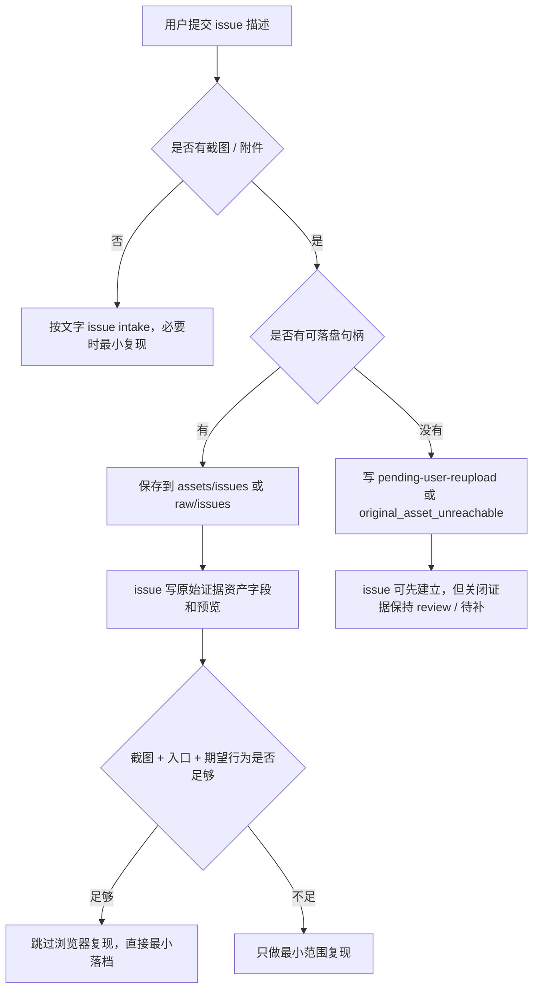

# Issue 原始证据资产入库缺口分析

相关：[[concepts/agent-governance]]、[[concepts/harness-engineering]]、[[instruction-adherence]]、[[response-mode-routing]]、[[skills/issue-analysis/SKILL]]、[[projects/development/issues/README]]

## 来源与调研依据

- **用户纠偏**：用户上传截图和问题描述后，agent 生成 issue 时没有沉淀原始图片证据，只写了“截图已提供 / 图片文件尚未保存”一类状态。
- **本库规则现状**：[[projects/development/issues/README]] 已要求原始现象保真；[[instruction-adherence]] 已把“用户提供截图、日志、接口响应或运行输出”列为触发信号；[[skills/issue-analysis/SKILL]] 已把截图列为直接证据。
- **官方技术依据**：
  - OpenAI Images and vision 文档显示，图片输入可以通过 URL、Base64、字节数组或 `file_id` 进入模型；这说明“模型可理解图片”与“本地仓库已保存原图”是两个动作。来源：[Images and vision](https://developers.openai.com/api/docs/guides/images-vision)。
  - OpenAI File inputs 文档显示，文件输入通过 Files API 创建文件并用 `file_id` 传入模型；这同样说明文件引用、模型输入和本地知识库归档之间需要显式桥接。来源：[File inputs](https://developers.openai.com/api/docs/guides/file-inputs)。
  - Codex 官方手册说明 skill 是可复用工作流，依赖清晰 description 触发；`AGENTS.md` 是持久项目指导，但会受加载顺序、大小和层级影响。来源：[Codex skills](https://developers.openai.com/codex/skills)、[AGENTS.md](https://developers.openai.com/codex/guides/agents-md)。

## 一句话总结

这不是单纯“issue skill 没触发”，而是 **Issue Intake 把“模型看到了截图”误当成“知识库已经保存了原始证据资产”**。根因是证据资产入库没有成为独立的 intake 合同、模板字段和最终证明。

## 为什么总出现

### 1. 技术层：可见输入和可落盘文件不是一回事

当前对话里，agent 可能能看到上传图片并理解其中内容，但这不代表它一定拿到了：

- 上传图片的本地文件路径。
- 原始二进制字节。
- 可下载 URL。
- Files API 的可复用 `file_id`。
- 能写入仓库的附件句柄。

所以正确判断应该是四层状态，而不是一句“截图已提供”：

| 层级 | 含义 | 是否足够关闭证据入库 |
| --- | --- | --- |
| `visible_to_model` | 模型能看图并描述内容 | 否 |
| `asset_handle_available` | agent 有路径、URL、字节或文件 ID | 否 |
| `saved_in_repo` | 原图已进入 `assets/` 或 `raw/` 并被 issue 链接 | 是 |
| `closure_evidence_complete` | issue 可用原图、复现、报告和回归守卫支持关闭 | 视关闭对象而定 |

失败通常发生在第一层到第三层之间：agent 看得懂图，但没有把图片变成仓库资产。

### 2. 规则层：已有规则强调“原始现象”，没有单独定义“原始资产”

“原始现象保真”容易被 agent 理解成：

- 把用户看到什么写下来。
- 摘要图片中的文字或红框。
- 标注“用户提供了截图”。

但 issue 证据链需要的是更强的资产合同：

- 原图在哪里。
- 是否可渲染。
- 是否和 issue 同生命周期保存。
- 若未保存，为什么未保存，谁补，补到哪里。

没有这个资产合同，agent 会自然选择最省力的文字摘要，因为文字摘要也看起来像“保真”。

### 3. 响应模式层：Issue 快路径只优化了“少复现”，没有保护“先归档”

此前治理过一个相邻问题：用户已经给了截图、入口和期望行为时，不应默认再打开浏览器复现，避免 issue 归档变慢。

这个优化是对的，但缺了一个前置门：

> 跳过浏览器复现之前，先判断用户截图是否已经成为本地证据资产。

没有这个前置门，快路径会从“少复现”滑成“直接写文字 issue”，证据保存反而被跳过。

### 4. 执行层：skill / AGENTS / 自然语言规则都不是强证明

Codex 官方手册里，skill 依靠 description 和任务匹配触发；AGENTS.md 是持久指导，但仍是上下文里的自然语言。它们能提高概率，却不能证明某个附件已经落盘。

因此这类问题不能靠“再写一句更严厉的规则”解决。高可靠方案必须把证据入库拆成可见字段、状态枚举和最终证明。

## 最完善且高效的方案

### 核心原则

最优解不是“每次都浏览器复现”，也不是“每次都问用户重传”。最优解是建立 **Issue Evidence Intake Protocol**：

1. 用户已给截图、入口和期望行为时，跳过浏览器自主复现。
2. 但在写 issue 正文前，必须先跑“原始证据资产门”。
3. 只有原图已入库或明确标成待补，issue 才能继续落档。
4. 证据入库状态和 issue 状态分离，避免把 `visible_to_model` 写成 `saved_in_repo`。

### 证据资产门

每次 issue intake 看到截图、图片、日志、接口响应、运行输出或附件，先做 5 个判断：

| 判断 | 输出 |
| --- | --- |
| 用户提供了什么原始材料 | `screenshot / image / log / api_response / db_export / artifact / recording / other` |
| 当前是否有可落盘句柄 | `path / bytes / url / file_id / none` |
| 应该保存到哪里 | `assets/issues/<ISSUE-ID>/` 或 `raw/issues/<ISSUE-ID>/` |
| 当前保存状态 | `saved / pending-user-reupload / original_asset_unreachable` |
| 是否阻塞关闭 | `blocking / non-blocking / unknown` |

### 推荐字段

Issue 页面不需要很重，但必须有这个最小字段块：

```markdown
## 原始证据资产

- 用户原始材料：
- 可访问性：visible_to_model / asset_handle_available / saved_in_repo
- 保存状态：saved / pending-user-reupload / original_asset_unreachable
- 本地资产路径：
- 嵌入预览：
- 未入库原因：
- 待补动作：
- 是否阻塞关闭：
```

这个字段块的作用不是增加文档负担，而是防止 agent 用“我看到了”替代“我保存了”。

### 推荐落点

- 用户截图、复现截图、视觉红框、UI 状态图：`assets/issues/<ISSUE-ID>/`
- 原始日志、API 响应、DB 导出、下载包、长文本来源：`raw/issues/<ISSUE-ID>/`
- Issue 正文只放预览、路径、状态和结论，不复制大段二进制内容。

### 状态语义

| 状态 | 含义 | 允许说什么 | 禁止说什么 |
| --- | --- | --- | --- |
| `saved` | 原始资产已进入仓库路径并被 issue 引用 | 原图已入库 | 无 |
| `pending-user-reupload` | 当前模型看得到，但没有文件句柄，需要用户重新以附件、路径或下载链接提供 | 已记录待补原图 | 原图已保存 |
| `original_asset_unreachable` | 当前平台没有提供可取回原图的能力，且无法靠本轮工具补救 | 原图不可达，只有视觉摘要 | 证据完整 |

### 高效执行路径



这条路径同时满足：

- **更快**：用户截图足够时不默认浏览器复现。
- **更真**：不丢原图，不把摘要当证据。
- **更稳**：平台拿不到原图时，不假装已保存。
- **更可维护**：issue 正文只多一个小字段块，不引入全量治理流程。

## 采纳建议

### P0：先改 intake 语义

把“用户上传截图”从普通证据描述升级为“证据资产处理动作”。任何 issue intake 都先回答：

- 这张图现在只是 `visible_to_model`，还是已经 `saved_in_repo`？
- 如果不是 `saved_in_repo`，是否需要用户补原图？

### P1：补 issue 模板字段

模板只需要新增 `原始证据资产` 小节，不需要把 issue 模板变成复杂报告。

### P2：补 issue skill 的 0 号步骤

`issue-analysis` skill 的第 0 步应先过证据资产门，再进入问题框、事实源地图和根因链。

### P3：再考虑 sensor

等模板和 skill 稳定后，再做轻量 sensor，检查：

- issue 模板是否保留 `原始证据资产` 字段。
- issue skill 是否保留证据资产门。
- 新 issue 如果出现“截图已提供”但没有路径和状态，提示人工复核。

sensor 是后置防漏，不应替代 intake 语义。

## 边界

- 本页是知识库分析，不表示当前所有工程规则已经自动生效。
- 这类问题不应被写成业务 issue；它属于 agent / harness 的证据保真缺口。
- 如果当前平台没有给 agent 上传图的原始文件句柄，agent 最正确的行为不是硬编路径，而是明确写 `pending-user-reupload` 或 `original_asset_unreachable`。
- “截图内容摘要”只能是辅助证据，不能替代本地原图资产。

## 可复用结论

1. **Issue Intake 的第一防线不是复现，而是证据资产化。**
2. **模型可见不等于仓库可追溯。**
3. **快路径必须先过证据资产门，否则会把效率优化变成证据丢失。**
4. **最小字段块比长规则更有效，因为它强迫 agent 区分 `visible`、`handle` 和 `saved`。**
5. **拿不到原图时，应显性阻塞证据完整性，而不是补一句“截图已提供”。**
