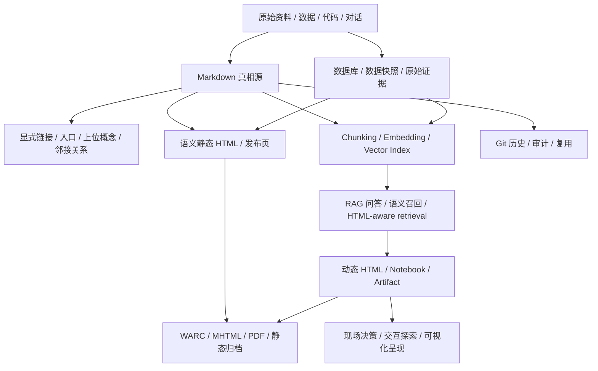

# AI 时代信息记录、处理与呈现方式调研

## 来源

- [Retrieval-Augmented Generation for Knowledge-Intensive NLP Tasks](https://arxiv.org/abs/2005.11401)
- [Pinecone: Chunking Strategies for LLM Applications](https://www.pinecone.io/learn/chunking-strategies/)
- [LangChain: Text splitters](https://docs.langchain.com/oss/python/integrations/splitters/index)
- [Vannevar Bush: As We May Think](https://www.theatlantic.com/magazine/archive/1945/07/as-we-may-think/303881/)
- [DARPA: oN-Line System](https://www.darpa.mil/about/innovation-timeline/on-line-system)
- [Ted Nelson's Home Page / Xanadu](https://www.aus.xanadu.com/ted/XU/XuPageKeio.html)
- [CERN: Where the web was born](https://home.web.cern.ch/science/computing/where-web-was-born)
- [W3C: History](https://www.w3.org/about/history/)
- [Daring Fireball: Markdown](https://daringfireball.net/projects/markdown/)
- [CommonMark](https://commonmark.org/)
- [WikiWikiWeb](https://wiki.c2.com/)
- [Edward Tufte: The Cognitive Style of PowerPoint](https://www.edwardtufte.com/book/the-cognitive-style-of-powerpoint-pitching-out-corrupts-within-ebook/)
- [Bret Victor: Magic Ink](https://worrydream.com/MagicInk/)
- [Andrej Karpathy: Software Is Changing (Again)](https://rosetta.to/u/ycombinator/andrej-karpathy-software-is-changing-again)
- [The /llms.txt file](https://llmstxt.org/)
- [Mintlify: llms.txt](https://mintlify.mintlify.app/ai/llmstxt)
- [Anthropic: Introducing the Model Context Protocol](https://www.anthropic.com/news/model-context-protocol)
- [Model Context Protocol Blog](https://blog.modelcontextprotocol.io/)
- [OpenAI: Connectors and MCP servers](https://platform.openai.com/docs/guides/tools-remote-mcp)
- [OpenAI: Build with the Apps SDK](https://help.openai.com/en/articles/12515353-build-with-the-apps-sdk)
- [OpenAI: The next evolution of the Agents SDK](https://openai.com/index/the-next-evolution-of-the-agents-sdk/)
- [Anthropic: What are artifacts and how do I use them?](https://support.claude.com/en/articles/9487310-what-are-artifacts-and-how-do-i-use-them)
- [Claude: Turn ideas into interactive AI-powered apps](https://claude.com/blog/build-artifacts)
- [OpenAI Help: ChatGPT Canvas](https://help.openai.com/en/articles/9930697-what-is-the-canvas-feature-in-chatgpt-and-how-do-i-use-i)
- [Quarto Presentations](https://quarto.org/docs/presentations/index.html)
- [Quarto Revealjs](https://quarto.org/docs/presentations/revealjs/)
- [Observable Notebooks](https://observablehq.com/)
- [Observable Framework](https://observablehq.com/framework/)
- [MDN: HTML: HyperText Markup Language](https://developer.mozilla.org/en-US/docs/Web/HTML)
- [W3C: Web Standards](https://www.w3.org/standards/)
- [HtmlRAG: HTML is Better Than Plain Text for Modeling Retrieved Knowledge in RAG Systems](https://arxiv.org/abs/2411.02959)
- [ISO 28500:2017 WARC file format](https://www.iso.org/standard/68004.html)
- [RFC 2557: MIME Encapsulation of Aggregate Documents, such as HTML](https://datatracker.ietf.org/doc/rfc2557/)

## 一句话总结

AI 时代的信息系统要分开看三件事：**信息记录**保存事实和版本，**信息处理**让模型检索、理解和重组，**信息呈现**把结果交给人决策；Markdown 正在同时承担记录和处理主链，HTML 正在从呈现层向部分记录层扩张，但只有语义化、静态化、自包含、版本化、可归档的 HTML 才适合作为长期记录。

## 结论先行

1. **以前的主链是记录格式和处理格式分离**：记录靠 PDF、Word、PPT、网页、Markdown 等文件；AI 处理时再把这些文件抽文本、切 chunk、做 embedding、进向量库。
2. **后来的主链开始合并为 Markdown**：Markdown 既能做人类可读记录，又天然适合 LLM 读取、diff、检索、链接、拼接和 agent 操作；`llms.txt` 这类约定进一步说明 Markdown 正在成为 agent-readable context 的低噪声入口。
3. **总结汇报正在从 PPT 转向 HTML**：当汇报需要筛选、模拟、钻取、实时改数、嵌入代码或现场交互时，HTML / Artifact / Notebook 更像决策界面；PPT / PDF 更像最终分发和归档格式。
4. **HTML 会成为一部分信息记录，但不会无条件取代 Markdown**：HTML 原本就是文档标记语言，语义标签、链接、表格、结构和可访问性都能承载记录；但依赖 JS、远程接口、运行时状态和临时数据的 HTML 更像应用界面，不是稳定记录。
5. **最佳架构不是三选一，而是职责分离**：Markdown 做轻量真相源，向量索引做派生处理层，语义 HTML / WARC / MHTML 可做特定记录或归档，动态 HTML / Artifact / Notebook 做实时呈现层，PPT / PDF 保留正式分发边界。

## 概念校正：记录、处理、呈现不是一回事

| 职能 | 要回答的问题 | 传统形态 | AI 时代趋势 | 成功标准 |
| --- | --- | --- | --- | --- |
| 信息记录 | 事实、来源、版本和责任保存在哪里 | PDF、Word、PPT、Markdown、网页、数据库 | Markdown 成为轻量主记录；语义 HTML 在发布、网页归档和交互文档里扩大记录角色 | 可读、可 diff、可引用、可归档、可回到来源 |
| 信息处理 | 模型怎样找到、理解、组合和生成 | 文档抽取、chunk、embedding、向量库、全文搜索 | Markdown + 链接 + metadata + RAG；HTML 结构也可被保留进 RAG | 召回准、上下文完整、结构不丢、证据可追溯 |
| 信息呈现 | 怎样让人快速理解、比较、决策和行动 | PPT、PDF、Word 报告、静态截图 | HTML report、Artifact、Notebook、dashboard、interactive slides | 可交互、可钻取、可复现、可导出、权限清楚 |

关键变化不是“某个格式赢了”，而是过去一个文件常常同时承担记录、处理和呈现；AI 时代更稳定的设计是把三种职能拆开，再让格式按职能组合。

## 历史谱系：从联想路径到 agent-readable context

| 时间 | 人物 / 来源 | 关键贡献 | 对当前分类的启发 |
| --- | --- | --- | --- |
| 1945 | Vannevar Bush / Memex | 提出通过 associative trails 组织资料，而不是只按书架或目录查找 | 信息组织层早于 AI 出现；“关系”不是检索的附属品 |
| 1960s | Ted Nelson / Xanadu | 提出 hypertext、非线性写作、跨文档引用和版本互联愿景 | 超链接不只是导航，也可以承接引用、版本、署名和可追溯性 |
| 1968 | Douglas Engelbart / NLS | 在“Mother of All Demos”时代展示鼠标、窗口、超文本、协作编辑和 presentation programs | 记录、组织、呈现、协作从早期就是同一套增强人类智力系统的一部分 |
| 1989-1991 | Tim Berners-Lee / CERN Web | 把个人电脑、网络和 hypertext 合并成全球信息系统，并用 HTML 成为 Web 发布格式 | HTML 的原始身份就是“可链接文档格式”，不是后来才有的视觉页面 |
| 1995 | Ward Cunningham / WikiWikiWeb | 让网页变成可协作编辑、可持续链接、可演化的知识空间 | wiki 证明信息记录和组织可以在同一界面内协作完成 |
| 2003-2004 | Edward Tufte / PowerPoint 批评 | 批评 slideware 容易降低分析密度、压扁证据和推理 | PPT 的问题不是“视觉”，而是线性、低密度、模板化的认知风格 |
| 2004 | John Gruber / Aaron Swartz / Markdown | 用易读纯文本写结构化文档，再转成有效 HTML | Markdown 是“记录格式 + 发布中间层 + 模型友好文本”的早期统一体 |
| 2006 | Bret Victor / Magic Ink | 强调多数软件是 information software，好的界面应帮助人学习、比较、判断 | HTML dashboard / Artifact 的价值不是“能点”，而是更好地组织决策所需信息 |
| 2020 | RAG | 把外部知识检索接入生成模型 | chunk + vector 解决处理层召回，但不自动解决记录、组织和呈现 |
| 2024-2025 | `llms.txt`、Karpathy Software 3.0 | 把网站 / 文档改造成 LLM 可读、agent 可执行的上下文入口 | Markdown + 命令化入口成为人和 agent 共享的信息基座 |
| 2024-2026 | MCP、Artifacts、Canvas、Observable、Quarto | agent 可以接工具和数据，结果可生成 HTML 应用、dashboard、report 和 slide deck | 信息呈现开始变成可操作界面；信息处理开始接入真实系统 |

这条历史线说明：AI 时代的新东西不是“突然从 PPT 变 HTML”，而是超文本、wiki、纯文本、可视化、RAG、agent 工具协议在同一个方向上重新汇合：让信息同时可保存、可链接、可计算、可呈现、可行动。

## 名人和专业网站观点地图

| 来源 | 可吸收观点 | 对本专题的判断意义 |
| --- | --- | --- |
| Vannevar Bush | 人类知识活动依赖 associative indexing 和 trails | “组织”应独立成层，不能被 chunk 检索吞掉 |
| Ted Nelson | 超文本理想包含持久引用、版本和双向关系 | 当下 Web / Markdown 链接仍是不完整超文本；更深系统要补版本、来源和反链 |
| Engelbart / DARPA | 计算机是增强集体智力的工作环境 | 文档不是静态材料，而是协作、呈现和行动系统的一部分 |
| Tim Berners-Lee / CERN / W3C | Web 是全球 linked information system，HTML 是超文本发布格式 | HTML 天然有记录属性，但现代动态 Web 需要额外归档治理 |
| Ward Cunningham | wiki 让记录、链接和协作演化合一 | Markdown + wikilink 的趋势不是复古，而是回到可编辑知识网络 |
| John Gruber / CommonMark | Markdown 的核心是易读纯文本到结构化 HTML 的转换 | Markdown 适合作为 agent-readable source，但规范差异和扩展方言要治理 |
| Edward Tufte | PPT 的 cognitive style 会压低分析质量 | HTML 替代 PPT 的真正理由是提高信息密度、比较能力和证据可见性 |
| Bret Victor | 信息软件应帮助用户学习、比较、决策；交互不是目的 | HTML report / dashboard 的价值在于减少认知负担，而不是增加按钮 |
| Andrej Karpathy | LLM 时代软件基础设施应让文档可被 LLM 读懂，让操作可被 agent 执行 | AI 时代文档应包含 Markdown、命令、API、路径和可执行证据 |
| Jeremy Howard / `llms.txt` | 给 LLM 提供 curated Markdown 入口，避免网页噪声和上下文窗口浪费 | agent-readable publishing 正在成为 Web 之外的第二入口 |
| Anthropic / OpenAI / MCP | 模型通过协议连接工具、数据源和外部系统 | 信息处理层不再只是检索，还包括行动、权限和安全治理 |
| Observable / Quarto | 数据、代码、解释和 HTML 呈现可以从同一源工作流生成 | HTML 既可以是呈现，也可以在保留源和快照时成为可复现报告 |

## 最新技术谱系：截至 2026-06-05

| 技术趋势 | 最新形态 | 改变了哪一层 | 关键边界 |
| --- | --- | --- | --- |
| RAG 从 naive chunking 走向结构化 context | hybrid search、metadata filtering、parent-child chunk、HTML-aware RAG、long-context reranking | 处理层 | 仍必须回到源文件、版本和证据，不能把召回结果当事实裁决 |
| Markdown docs / `.md` variants / `llms.txt` | 文档站提供 Markdown 入口、`llms-full.txt`、AI-readable docs | 记录 + 组织 + 处理 | `llms.txt` 是提案 / 约定，不是保证被所有 AI 系统读取的正式标准 |
| MCP / connectors / remote tools | 模型可以访问 GitHub、文件、数据库、业务系统和自定义工具 | 处理 + 行动 | 权限、注入、审计、数据外泄和工具误用成为 P0 问题 |
| Agent harness 文件 | `AGENTS.md`、skills、manifests、workspace rules、tool specs | 组织 + 处理 | 这些不是普通说明书，而是 agent 的执行环境和边界 |
| Artifacts / Canvas / generative UI | 模型直接生成 HTML、React、SVG、dashboard、可交互小应用 | 呈现 + 探索 | 生成物要区分临时演示、可复现报告和可长期运行应用 |
| Observable / Quarto / notebooks | 代码、数据、文字、图表和 HTML 输出统一 | 记录 + 处理 + 呈现 | 要保留源、数据快照、依赖版本，否则 HTML 只是最后一次渲染 |
| WARC / MHTML / static package | 保存网页资源、HTML 和上下文快照 | 归档 + 记录 | 适合证据和发布状态，不等于可继续编辑的真相源 |
| 长上下文模型 | 可直接读更长文档，减少一部分 chunk 压力 | 处理 | 长上下文不能替代结构化入口、引用、版本和权限边界 |

最重要的最新变化是：信息处理层正在从“检索片段”升级为“带权限的上下文组装和工具调用”；信息呈现层正在从“静态汇报”升级为“可操作界面”；信息记录层则必须更强调来源、版本、可归档和可复现，否则很容易被动态界面吞掉。

## 更完整的分类模型

如果只分“记录 / 处理 / 呈现”，方向是对的，但还不够完整。更完整的模型应当分成五层：

| 层 | 职责 | 典型对象 | 核心保证 |
| --- | --- | --- | --- |
| 记录层 | 保存事实、来源、版本、责任和裁决 | Markdown、数据库、语义 HTML、原始文件、数据快照 | 可读、可引用、可版本化 |
| 组织层 | 表达关系、上下文、层级、依赖和语义入口 | wikilink、目录、metadata、trace、concept map、`llms.txt` | 可发现、可解释、可维护 |
| 处理层 | 检索、抽取、重排、总结、推理、调用工具 | RAG、embedding、search、MCP、agents、HTML-aware retrieval | 可追溯、可控权、可验证 |
| 呈现层 | 让人理解、比较、探索、决策和行动 | HTML report、dashboard、Artifact、Canvas、Notebook、slides | 信息密度、交互性、低认知负担 |
| 归档 / 分发层 | 固化发布状态、交付材料和证据包 | PDF、PPTX、WARC、MHTML、static HTML package | 稳定、可审计、可离线复查 |

这五层不是瀑布，而是可以互相映射：

- Markdown 可以同时在记录层、组织层和处理层。
- 语义静态 HTML 可以同时在记录层、呈现层和归档层。
- 动态 HTML / dashboard 默认在呈现层，只有补齐源、快照和归档才进入记录层。
- 向量库主要在处理层，不应上升为记录层。
- PPT / PDF 主要在归档 / 分发层，不应反向定义知识组织方式。

更深的判断标准不是“这个格式是什么”，而是它提供了哪些 guarantee：

| Guarantee | 问题 | 典型实现 |
| --- | --- | --- |
| 可读性 | 人和模型能否低噪声读懂 | Markdown、语义 HTML、清晰标题 |
| 可寻址性 | 能否稳定引用到段落、版本或对象 | URL、anchor、ID、文件路径、commit |
| 可关系化 | 能否表达上位、邻接、来源、依赖、冲突 | wikilink、metadata、trace、graph |
| 可计算性 | 能否被检索、抽取、执行和重组 | chunk、embedding、RAG、MCP、API |
| 可呈现性 | 能否帮助人比较、探索、决策 | HTML、charts、dashboard、Notebook |
| 可复现性 | 能否重新生成同一结果 | source、data snapshot、lockfile、build script |
| 可归档性 | 能否长期保存发布状态和证据 | PDF、WARC、MHTML、static package |
| 可治理性 | 权限、审计、安全和责任是否清楚 | ACL、logs、signing、review、provenance |

因此，分类的最终形态应该是：**职能层级 + 格式能力 + guarantee**，而不是单纯列出 PDF / MD / HTML / vector DB。

## 演进脉络

### 阶段一：记录靠文件，处理靠 chunk + 向量

RAG 的经典表达来自 2020 年 Lewis 等人的论文：模型把参数记忆和外部非参数记忆结合起来，检索外部知识后再生成答案。工程化落地后，常见流水线变成：

1. 收集 PDF、网页、文档、工单、代码等资料。
2. 清洗成文本。
3. 切成 chunk。
4. 对 chunk 生成 embedding。
5. 存进向量数据库。
6. 查询时按语义相似度召回片段，再交给模型生成答案。

这个范式解决了早期 LLM 的三个痛点：

- 上下文窗口有限，不能一次塞入全部文档。
- 模型知识过时，需要接入外部资料。
- 模型容易幻觉，需要引用可追溯来源。

但它也引入了新的结构性问题：

- **切片会破坏上下文**：固定长度或递归切分可能把章节、表格、前提、例外、结论拆散。
- **召回不是理解**：向量相似只能告诉模型“可能相关”，不能告诉它“这段在整体知识图中的位置”。
- **关系不可见**：父子关系、依赖、冲突、演进、状态、证据层级通常被压扁成 metadata。
- **维护成本后移**：文档更新后需要重新切分、重新索引、处理版本和失效 chunk。

因此，chunk / vector store 更像信息处理层的派生索引，而不是记录层或呈现层本身。

## 阶段二：记录和处理都开始向 Markdown 收敛

第二个趋势不是反对 RAG，而是把“知识的主形态”从向量索引拉回可读源文件。

Karpathy 在 2025 年 YC 演讲里把 LLM 称为新的 Software 3.0 计算范式，并特别指出基础设施要适配 LLM：文档要让 LLM 读得懂，操作要从“点击这里”转换成 agent 能执行的命令。这里的核心不是“Markdown 比 HTML 高级”，而是：

- Markdown 可读、可 diff、可版本管理。
- 标题、列表、代码块、链接天然适合模型解析。
- 超链接把知识从孤立文档变成显式关系。
- Git 历史让修改原因、责任和时间可追溯。
- 人和 agent 可以共享同一份源文件，不必维护“给人看的版”和“给模型看的版”。

`llms.txt` 进一步强化了这个方向：它提出用网站根目录的 Markdown 文件给 LLM 一个 curated overview，并链接到更适合模型读取的页面版本。Mintlify 等文档平台已经把 `llms.txt`、`llms-full.txt`、`.md` 页面变体和 discovery header 做成产品能力。

这一阶段的信息结构重心是：

- 从“把所有东西切碎”转向“先维护可读结构，再按需要索引”。
- 从“语义相似”转向“语义关系 + 显式链接 + 层级入口”。
- 从“检索答案”转向“构建 agent 可持续工作的上下文底座”。
- 从“记录给人读、处理给机器读”转向“同一份 Markdown 同时给人和模型读”。

这和本库的 [[concepts/document-os]]、[[knowledge-linking-rules]]、[[skills/knowledge-linking/SKILL]] 是同一条线：知识页不只要有内容，还要有入口、上位关系、邻接关系、反向回链和最小结构检查。

## 阶段三：HTML / Artifact / Notebook，实时呈现信息结果

第三个趋势是结果层从静态文档或 PPT，转向 HTML 化的交互界面。

这里不是说“所有人都不做 PPT”，更准确的判断是：当信息呈现需要实时计算、动态筛选、现场迭代、可视化探索或用户操作时，PPT 已经不是最佳默认形态。

代表形态包括：

- **Claude Artifacts**：把长文档、代码、单页 HTML、SVG、流程图、React 组件等放进独立窗口，可继续迭代；新能力还支持 AI-powered artifacts 和 MCP 集成。
- **ChatGPT Canvas / Web preview**：在协同编辑空间里生成和预览 HTML / JS 内容，但需要处理外部网络访问和安全确认。
- **Observable Notebook**：把 Markdown、JavaScript、HTML、SQL、数据连接和交互控件组合成浏览器里的动态文档。
- **Quarto reveal.js**：仍可用 Markdown 写源文件，但输出 HTML slide deck，也能导出 PDF / PPTX；适合从同一源文件生成不同交付格式。

HTML 呈现的本质优势是：

- 可以把数据、图表、筛选器、解释、状态和行动按钮放在同一界面。
- 可以按听众问题实时切换视角，而不是线性翻页。
- 可以让读者自己钻取、比较、复现，而不是只看截图。
- 可以嵌入模型、工具、API 或本地数据，形成“活报告”。
- 可以把一次汇报沉淀成后续还能继续使用的小工具。

它的风险也更大：

- 安全边界更复杂，HTML / JS 可能访问外部资源或泄露输入。
- 可复现性需要额外治理，不能只保存最终截图。
- 分享和权限不如 PPT / PDF 稳定，尤其在组织外流转时。
- 长期归档需要保存源文件、数据快照、构建方式和依赖版本。

所以 HTML 应该承担“实时交互层”，而 Markdown / 数据快照 / 引用来源仍应承担真相源和审计层。

## HTML 会不会成为信息记录格式

结论要分两类 HTML。

### 1. 语义 HTML：可以成为记录格式

HTML 的基本定义不是“漂亮网页”，而是用 markup 定义 Web 内容的意义和结构。MDN 对 HTML 的解释也把它放在结构层：HTML 定义 web content 的 meaning and structure，CSS 负责外观，JavaScript 负责行为。W3C 也把 HTML 称为 Web 的 cornerstone，并强调开放 Web 标准的互操作、可访问性和持久 URI。

因此，下面这类 HTML 可以成为记录：

- 静态文章页、技术文档页、规格说明页。
- 使用 `article`、`section`、`h1`、`table`、`figure`、`time` 等语义结构的页面。
- 可从源文件构建、可版本化、可离线保存的 HTML report。
- HTML + metadata + canonical source 共同组成的网页发布记录。
- 通过 WARC / MHTML / 单文件 HTML 保存的网页快照或交付包。

HtmlRAG 这类研究也说明：如果把网页 HTML 直接粗暴抽成 plain text，会损失标题、表格等结构语义；保留清洗后的 HTML 结构，可能更利于 RAG 建模外部知识。这说明 HTML 不只是视觉呈现，也可能成为处理层的结构化输入。

### 2. 动态 HTML 应用：默认不是长期记录

另一类 HTML 更像运行界面：

- 依赖远程 API 实时取数。
- 依赖 JavaScript 计算状态。
- 图表只在 Canvas / WebGL 中渲染，缺少底层数据快照。
- 权限、筛选条件、用户操作路径决定最终内容。
- 静态保存后无法复现原始视图。

这类 HTML 当然可以作为呈现层、工作台或交互报告，但不能默认当作记录层。要把它升级成记录，至少要补齐：

- 源数据快照或查询版本。
- 构建脚本和依赖版本。
- HTML / CSS / JS / 图片等资源的自包含保存。
- 关键交互状态、筛选条件和生成时间。
- 可降级的文本摘要或 Markdown source。
- WARC、MHTML、PDF、静态 HTML package 等归档形态。

### 3. 判断标准

| HTML 类型 | 是否适合作记录 | 原因 |
| --- | --- | --- |
| 语义静态 HTML 文档 | 是 | 有正文结构、链接、元数据和稳定引用 |
| 由 Markdown / Quarto / Notebook 构建出的静态 HTML | 条件成立 | 需要保留源、数据快照和构建方式 |
| 单文件 HTML 报告 | 条件成立 | 自包含性强，但要检查数据、脚本和安全边界 |
| WARC / MHTML 网页归档 | 是，但偏归档层 | 记录网页及资源状态，适合保存发布结果或证据 |
| 动态 dashboard / Artifact / SPA | 默认否 | 依赖运行时、远程数据和交互状态 |
| HTML + 后端数据库 + 权限系统 | 否，记录在数据库和审计日志 | HTML 只是操作入口和呈现界面 |

## 主要范式对比

| 范式 | 核心对象 | 主要职能 | 最大价值 | 主要风险 |
| --- | --- | --- | --- | --- |
| PDF / Word / PPT / 网页文件 | 固定文档和发布结果 | 记录 + 分发 | 稳定、可流转、符合传统组织流程 | 对模型处理不友好，结构常被抽取时破坏 |
| Chunk + 向量库 | 片段、embedding、metadata | 处理 | 快速找到可能相关内容 | 上下文被切碎、关系不可见、版本和证据层级弱 |
| Markdown + 超链接 | 源文档、标题层级、双向链接、Git | 记录 + 处理 | 人和模型共享可读真相源 | 需要人工或 agent 维护关系，不会自动保证语义正确 |
| 语义静态 HTML | `article`、`section`、链接、表格、metadata | 记录 + 呈现 + 部分处理 | 同时适合浏览器阅读、链接发布和结构保留 | 如果源和归档缺失，容易变成只剩发布结果 |
| 动态 HTML / Artifact / Notebook | 可交互页面、组件、图表、状态 | 呈现 + 探索 | 把信息结果变成可操作界面 | 安全、分享、归档、依赖、权限和复现更难治理 |
| PPT / PDF | 固定版式页面 | 分发 + 归档 | 稳定、可控、易审批 | 难交互、难更新、难复现、对 agent 不友好 |

## 信息形态选择矩阵

| 场景 | 首选形态 | 辅助形态 | 原因 |
| --- | --- | --- | --- |
| 大量历史材料问答 | RAG / vector index | Markdown source | 召回优先，但必须能回到源文件 |
| 项目知识库 / 规则库 | Markdown + wikilink | 结构检查 / 搜索索引 | 需要长期维护、diff、回链和单一信息源 |
| API / 技术文档给 agent 使用 | Markdown docs + `llms.txt` + 命令示例 | OpenAPI / MCP | 模型需要低噪声结构和可执行动作 |
| 研究调研沉淀 | Markdown article + concept page | HTML 摘要页 | 先保证来源、结论、关系可审计 |
| 发布型知识文章 | 语义 HTML + Markdown source | WARC / PDF | 面向阅读和引用，同时保留源和归档 |
| 数据分析汇报 | HTML dashboard / Observable / Artifact | Markdown 方法说明、CSV 快照 | 读者需要筛选、钻取和复现 |
| 方案评审 / 决策会 | HTML decision board | Markdown 决策记录、PDF 导出 | 现场需要对比、切换假设、记录裁决 |
| 对外正式交付 | PDF / PPTX | HTML demo、Markdown source | 分发稳定性和审批优先 |
| 教学 / 演示 | HTML slides / interactive artifact | Markdown lesson | 互动和即时反馈比固定页面重要 |

## 对知识库和团队的落地建议

### 1. 把 Markdown 当作主真相源

长期知识、项目规则、需求、设计、决策、复盘和调研应优先保留 Markdown 源文件。它们应该具备：

- 清晰标题层级。
- 明确来源。
- 上位概念和邻接链接。
- 更新日期和状态。
- 可 diff 的 Git 历史。

### 2. 把向量库当作派生索引

向量库不应该成为唯一知识库。更稳的架构是：

`Markdown / data source -> chunking / indexing -> vector DB -> retrieval -> answer / interface`

源文件变更后，索引可以重建；索引召回的结果必须能回到源文件、章节、版本和证据。

### 3. 把 HTML 分成记录型和呈现型

不要只问“要不要用 HTML”，而要先问它承担什么职责。

记录型 HTML 应该满足：

- 语义标签清楚。
- 内容不依赖临时运行态才能读懂。
- 有源文件、数据快照或 canonical version。
- 可以被归档、引用和离线保存。

呈现型 HTML 适合：

- 数据报告：用 dashboard、Notebook、Artifact。
- 产品方案：用交互原型或 decision board。
- 架构解释：用可折叠图、状态机、链路图。
- 评审材料：用 HTML slide / report，同时导出 PDF 做归档。

### 4. 保留 PPT / PDF 的边界

PPT / PDF 适合最终分发，不适合做信息生产主链。合理分工是：

- Markdown：源和审计。
- RAG：召回和问答。
- HTML：实时呈现和操作。
- PPT / PDF：审批、归档、外部分发。

### 5. 给 agent 留可执行入口

文档里不要只写“点击按钮”“打开页面看看”。AI agent 需要：

- 命令行示例。
- API / curl 示例。
- 文件路径。
- 预期输出。
- 权限边界。
- 错误处理方式。

这也是 Karpathy 对 agent 友好基础设施的核心启发：不是把旧文档机械转换成 Markdown，而是重写为模型能读、工具能执行、人能审计的工作界面。

## 推荐架构

这套架构的关键是：**记录、处理、呈现、归档分离**。不要让向量库替代源文件，不要让动态 HTML 替代审计，不要让 PPT 反向定义知识结构，也不要把所有 HTML 都简单归入同一类。

## 对本库的启发

本库当前的方向是正确的：以 Markdown 文件作为主真相源，通过 [[knowledge-linking-rules]] 和 [[skills/knowledge-linking/SKILL]] 补入口、上位、邻接和反向链接，再用 sensor 检查孤岛知识。

后续可继续演进的方向：

- 在“源、索引、关系、界面、归档”五层之外，为复杂系统补一层 [[concepts/problem-focused-information-presentation|问题聚焦式信息呈现]]：每次先判断读者当前关注的是状态、计划、决策、故障、验收、知识还是资源，再生成对应 lens。
- 给重要专题维护 `llms.txt` 风格的专题入口，让 agent 快速读取高信号材料。
- 对长篇调研建立派生索引，但保留 Markdown 章节为引用单位。
- 当调研结果进入评审或教学场景时，生成 HTML report / dashboard，而不是手工做 PPT。
- 对 HTML 产物先判定是记录型还是呈现型：记录型要语义化、版本化和可归档；呈现型要保留源 Markdown、数据快照、构建说明和导出归档。

## 仍需保留的判断边界

- 不要把“HTML 实时呈现”误解成所有文档都要做网页应用。
- 不要把“HTML 可以记录信息”误解成所有 HTML 都是可靠记录；动态 HTML 默认只是运行时界面。
- 不要把“Markdown + 链接”误解成不需要搜索和向量检索。
- 不要把 `llms.txt` 当作正式 Web 标准或排名保证；它更像 agent 友好的 discovery convention。
- 不要把 RAG 召回结果当作事实裁决；它只是候选证据。
- 不要让可视化漂亮程度盖过来源、版本、权限和验证边界。

## 相关概念

- [[concepts/ai-era-information-presentation]]
- [[concepts/problem-focused-information-presentation]]
- [[concepts/document-os]]
- [[concepts/harness-engineering]]
- [[knowledge-linking-rules]]
- [[skills/knowledge-linking/SKILL]]
- [[articles/2026-06-04-knowledge-linking-mechanism-research]]

## 知识关联自检

- 上位概念 / owning page：[[concepts/ai-era-information-presentation]]
- 邻接文章 / 案例：[[articles/2026-06-04-knowledge-linking-mechanism-research]]、[[articles/2026-04-09-obsidian-doc-system-design]]
- 入口回链：[[articles/README]]、[[INDEX]]、[[concepts/README]]
- 是否需要新建或更新概念页：已新增 [[concepts/ai-era-information-presentation]]

## 后续动作

- 如果后续要把本调研做成可演示材料，优先生成 HTML report / reveal.js，而不是先做 PPT。
- 如果要进入规则层，只抽象“源、索引、界面、归档分离”的稳定原则，不把某个工具栈直接写成硬规则。
