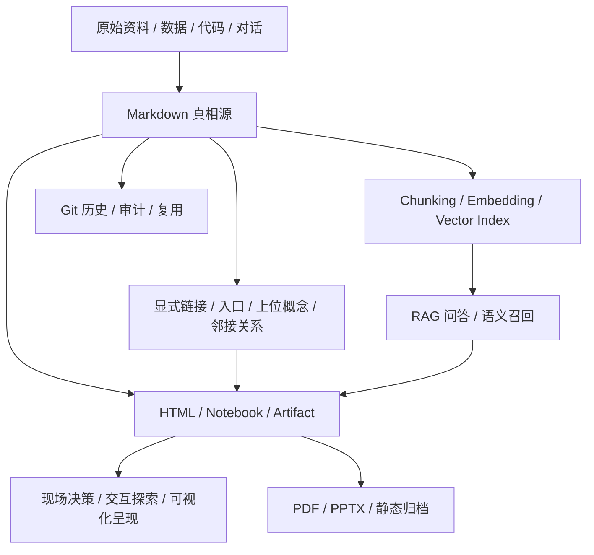

# AI 时代信息呈现方式调研

## 来源

- [Retrieval-Augmented Generation for Knowledge-Intensive NLP Tasks](https://arxiv.org/abs/2005.11401)
- [Pinecone: Chunking Strategies for LLM Applications](https://www.pinecone.io/learn/chunking-strategies/)
- [LangChain: Text splitters](https://docs.langchain.com/oss/python/integrations/splitters/index)
- [Andrej Karpathy: Software Is Changing (Again)](https://rosetta.to/u/ycombinator/andrej-karpathy-software-is-changing-again)
- [The /llms.txt file](https://llmstxt.org/)
- [Mintlify: llms.txt](https://mintlify.mintlify.app/ai/llmstxt)
- [Anthropic: Introducing the Model Context Protocol](https://www.anthropic.com/news/model-context-protocol)
- [Anthropic: What are artifacts and how do I use them?](https://support.claude.com/en/articles/9487310-what-are-artifacts-and-how-do-i-use-them)
- [OpenAI Help: ChatGPT Canvas](https://help.openai.com/en/articles/9930697-what-is-the-canvas-feature-in-chatgpt-and-how-do-i-use-i)
- [Quarto Presentations](https://quarto.org/docs/presentations/index.html)
- [Observable Notebooks](https://observablehq.com/)

## 一句话总结

AI 时代的信息呈现正在从“给人看的静态文档”，变成“给模型检索、给 agent 操作、给人实时决策的多层信息界面”：底层仍需要结构化文本和检索，中层需要 Markdown + 超链接的可维护关系网，上层越来越多用 HTML / Artifact / Notebook 做可交互、可更新、可验证的结果呈现。

## 结论先行

1. **Chunk + 向量库解决的是召回问题，不是知识组织问题**。它适合把大量资料变成可检索上下文，但容易丢掉章节层级、论证路径、版本责任和跨文档关系。
2. **Markdown + 超链接把信息从“片段库”拉回“源文件 + 关系网”**。Karpathy 在 Software 3.0 语境里强调 LLM 需要可读文档、命令化操作和 agent 友好基础设施；这和 `llms.txt`、Markdown docs、Obsidian / wiki 式双向链接是同一方向：让模型和人共享一套可读、可 diff、可维护的上下文。
3. **HTML 实时呈现不是 PPT 的简单替代，而是把报告升级成轻应用**。Claude Artifacts、ChatGPT Canvas、Observable、Quarto reveal.js 共同说明：当信息需要筛选、对比、模拟、钻取、复现或现场调整时，HTML 比 PPT 更接近“决策界面”。
4. **PPT 没有消失，只是从默认载体降级成分发格式**。正式汇报、组织归档、法务合规、客户交付、离线流转仍可能需要 PPT / PDF；但分析过程、动态演示、复杂决策和 agent 协作不应再被 PPT 绑死。
5. **最佳形态是三层并存**：Markdown 做真相源，检索索引做召回层，HTML / Notebook / Artifact 做交互呈现层；不要把任意一层当成万能替代。

## 演进脉络

### 阶段一：文档拆成 chunk，形成向量库

RAG 的经典表达来自 2020 年 Lewis 等人的论文：模型把参数记忆和外部非参数记忆结合起来，检索外部知识后再生成答案。工程化落地后，常见流水线变成：

1. 收集 PDF、网页、文档、工单、代码等资料。
2. 清洗成文本。
3. 切成 chunk。
4. 对 chunk 生成 embedding。
5. 存进向量数据库。
6. 查询时按语义相似度召回片段，再交给模型生成答案。

这个范式解决了早期 LLM 的三个痛点：

- 上下文窗口有限，不能一次塞入全部文档。
- 模型知识过时，需要接入外部资料。
- 模型容易幻觉，需要引用可追溯来源。

但它也引入了新的结构性问题：

- **切片会破坏上下文**：固定长度或递归切分可能把章节、表格、前提、例外、结论拆散。
- **召回不是理解**：向量相似只能告诉模型“可能相关”，不能告诉它“这段在整体知识图中的位置”。
- **关系不可见**：父子关系、依赖、冲突、演进、状态、证据层级通常被压扁成 metadata。
- **维护成本后移**：文档更新后需要重新切分、重新索引、处理版本和失效 chunk。

因此，chunk / vector store 更像信息呈现的底层召回机制，而不是最终的信息组织形态。

## 阶段二：Markdown + 超链接，形成可维护关系网

第二个趋势不是反对 RAG，而是把“知识的主形态”从向量索引拉回可读源文件。

Karpathy 在 2025 年 YC 演讲里把 LLM 称为新的 Software 3.0 计算范式，并特别指出基础设施要适配 LLM：文档要让 LLM 读得懂，操作要从“点击这里”转换成 agent 能执行的命令。这里的核心不是“Markdown 比 HTML 高级”，而是：

- Markdown 可读、可 diff、可版本管理。
- 标题、列表、代码块、链接天然适合模型解析。
- 超链接把知识从孤立文档变成显式关系。
- Git 历史让修改原因、责任和时间可追溯。
- 人和 agent 可以共享同一份源文件，不必维护“给人看的版”和“给模型看的版”。

`llms.txt` 进一步强化了这个方向：它提出用网站根目录的 Markdown 文件给 LLM 一个 curated overview，并链接到更适合模型读取的页面版本。Mintlify 等文档平台已经把 `llms.txt`、`llms-full.txt`、`.md` 页面变体和 discovery header 做成产品能力。

这一阶段的信息呈现重心是：

- 从“把所有东西切碎”转向“先维护可读结构，再按需要索引”。
- 从“语义相似”转向“语义关系 + 显式链接 + 层级入口”。
- 从“检索答案”转向“构建 agent 可持续工作的上下文底座”。

这和本库的 [[concepts/document-os]]、[[knowledge-linking-rules]]、[[skills/knowledge-linking/SKILL]] 是同一条线：知识页不只要有内容，还要有入口、上位关系、邻接关系、反向回链和最小结构检查。

## 阶段三：HTML / Artifact / Notebook，实时呈现信息结果

第三个趋势是结果层从静态文档或 PPT，转向 HTML 化的交互界面。

这里不是说“所有人都不做 PPT”，更准确的判断是：当信息呈现需要实时计算、动态筛选、现场迭代、可视化探索或用户操作时，PPT 已经不是最佳默认形态。

代表形态包括：

- **Claude Artifacts**：把长文档、代码、单页 HTML、SVG、流程图、React 组件等放进独立窗口，可继续迭代；新能力还支持 AI-powered artifacts 和 MCP 集成。
- **ChatGPT Canvas / Web preview**：在协同编辑空间里生成和预览 HTML / JS 内容，但需要处理外部网络访问和安全确认。
- **Observable Notebook**：把 Markdown、JavaScript、HTML、SQL、数据连接和交互控件组合成浏览器里的动态文档。
- **Quarto reveal.js**：仍可用 Markdown 写源文件，但输出 HTML slide deck，也能导出 PDF / PPTX；适合从同一源文件生成不同交付格式。

HTML 呈现的本质优势是：

- 可以把数据、图表、筛选器、解释、状态和行动按钮放在同一界面。
- 可以按听众问题实时切换视角，而不是线性翻页。
- 可以让读者自己钻取、比较、复现，而不是只看截图。
- 可以嵌入模型、工具、API 或本地数据，形成“活报告”。
- 可以把一次汇报沉淀成后续还能继续使用的小工具。

它的风险也更大：

- 安全边界更复杂，HTML / JS 可能访问外部资源或泄露输入。
- 可复现性需要额外治理，不能只保存最终截图。
- 分享和权限不如 PPT / PDF 稳定，尤其在组织外流转时。
- 长期归档需要保存源文件、数据快照、构建方式和依赖版本。

所以 HTML 应该承担“实时交互层”，而 Markdown / 数据快照 / 引用来源仍应承担真相源和审计层。

## 三种范式对比

| 范式 | 核心对象 | 最适合 | 最大价值 | 主要风险 |
| --- | --- | --- | --- | --- |
| Chunk + 向量库 | 片段、embedding、metadata | 大规模语义召回、问答、客服、代码库检索 | 快速找到可能相关内容 | 上下文被切碎、关系不可见、版本和证据层级弱 |
| Markdown + 超链接 | 源文档、标题层级、双向链接、Git | 知识库、项目上下文、agent 协作、长期维护 | 人和模型共享可读真相源 | 需要人工或 agent 维护关系，不会自动保证语义正确 |
| HTML / Artifact / Notebook | 可交互页面、组件、图表、状态 | 实时汇报、数据故事、决策工具、原型、工作台 | 把信息结果变成可操作界面 | 安全、分享、归档、依赖和权限更难治理 |
| PPT / PDF | 固定版式页面 | 正式分发、组织归档、客户材料、离线汇报 | 稳定、可控、易审批 | 难交互、难更新、难复现、对 agent 不友好 |

## 信息形态选择矩阵

| 场景 | 首选形态 | 辅助形态 | 原因 |
| --- | --- | --- | --- |
| 大量历史材料问答 | RAG / vector index | Markdown source | 召回优先，但必须能回到源文件 |
| 项目知识库 / 规则库 | Markdown + wikilink | 结构检查 / 搜索索引 | 需要长期维护、diff、回链和单一信息源 |
| API / 技术文档给 agent 使用 | Markdown docs + `llms.txt` + 命令示例 | OpenAPI / MCP | 模型需要低噪声结构和可执行动作 |
| 研究调研沉淀 | Markdown article + concept page | HTML 摘要页 | 先保证来源、结论、关系可审计 |
| 数据分析汇报 | HTML dashboard / Observable / Artifact | Markdown 方法说明、CSV 快照 | 读者需要筛选、钻取和复现 |
| 方案评审 / 决策会 | HTML decision board | Markdown 决策记录、PDF 导出 | 现场需要对比、切换假设、记录裁决 |
| 对外正式交付 | PDF / PPTX | HTML demo、Markdown source | 分发稳定性和审批优先 |
| 教学 / 演示 | HTML slides / interactive artifact | Markdown lesson | 互动和即时反馈比固定页面重要 |

## 对知识库和团队的落地建议

### 1. 把 Markdown 当作主真相源

长期知识、项目规则、需求、设计、决策、复盘和调研应优先保留 Markdown 源文件。它们应该具备：

- 清晰标题层级。
- 明确来源。
- 上位概念和邻接链接。
- 更新日期和状态。
- 可 diff 的 Git 历史。

### 2. 把向量库当作派生索引

向量库不应该成为唯一知识库。更稳的架构是：

`Markdown / data source -> chunking / indexing -> vector DB -> retrieval -> answer / interface`

源文件变更后，索引可以重建；索引召回的结果必须能回到源文件、章节、版本和证据。

### 3. 把 HTML 当作结果界面

只要信息结果需要“看 + 操作 + 比较 + 现场更新”，就优先考虑 HTML：

- 数据报告：用 dashboard、Notebook、Artifact。
- 产品方案：用交互原型或 decision board。
- 架构解释：用可折叠图、状态机、链路图。
- 评审材料：用 HTML slide / report，同时导出 PDF 做归档。

### 4. 保留 PPT / PDF 的边界

PPT / PDF 适合最终分发，不适合做信息生产主链。合理分工是：

- Markdown：源和审计。
- RAG：召回和问答。
- HTML：实时呈现和操作。
- PPT / PDF：审批、归档、外部分发。

### 5. 给 agent 留可执行入口

文档里不要只写“点击按钮”“打开页面看看”。AI agent 需要：

- 命令行示例。
- API / curl 示例。
- 文件路径。
- 预期输出。
- 权限边界。
- 错误处理方式。

这也是 Karpathy 对 agent 友好基础设施的核心启发：不是把旧文档机械转换成 Markdown，而是重写为模型能读、工具能执行、人能审计的工作界面。

## 推荐架构

这套架构的关键是：**源、索引、界面、归档分离**。不要让向量库替代源文件，不要让 HTML 替代审计，不要让 PPT 反向定义知识结构。

## 对本库的启发

本库当前的方向是正确的：以 Markdown 文件作为主真相源，通过 [[knowledge-linking-rules]] 和 [[skills/knowledge-linking/SKILL]] 补入口、上位、邻接和反向链接，再用 sensor 检查孤岛知识。

后续可继续演进的方向：

- 给重要专题维护 `llms.txt` 风格的专题入口，让 agent 快速读取高信号材料。
- 对长篇调研建立派生索引，但保留 Markdown 章节为引用单位。
- 当调研结果进入评审或教学场景时，生成 HTML report / dashboard，而不是手工做 PPT。
- 对 HTML 产物要求同时保留源 Markdown、数据快照、构建说明和导出归档。

## 仍需保留的判断边界

- 不要把“HTML 实时呈现”误解成所有文档都要做网页应用。
- 不要把“Markdown + 链接”误解成不需要搜索和向量检索。
- 不要把 `llms.txt` 当作正式 Web 标准或排名保证；它更像 agent 友好的 discovery convention。
- 不要把 RAG 召回结果当作事实裁决；它只是候选证据。
- 不要让可视化漂亮程度盖过来源、版本、权限和验证边界。

## 相关概念

- [[concepts/ai-era-information-presentation]]
- [[concepts/document-os]]
- [[concepts/harness-engineering]]
- [[knowledge-linking-rules]]
- [[skills/knowledge-linking/SKILL]]
- [[articles/2026-06-04-knowledge-linking-mechanism-research]]

## 知识关联自检

- 上位概念 / owning page：[[concepts/ai-era-information-presentation]]
- 邻接文章 / 案例：[[articles/2026-06-04-knowledge-linking-mechanism-research]]、[[articles/2026-04-09-obsidian-doc-system-design]]
- 入口回链：[[articles/README]]、[[INDEX]]、[[concepts/README]]
- 是否需要新建或更新概念页：已新增 [[concepts/ai-era-information-presentation]]

## 后续动作

- 如果后续要把本调研做成可演示材料，优先生成 HTML report / reveal.js，而不是先做 PPT。
- 如果要进入规则层，只抽象“源、索引、界面、归档分离”的稳定原则，不把某个工具栈直接写成硬规则。
